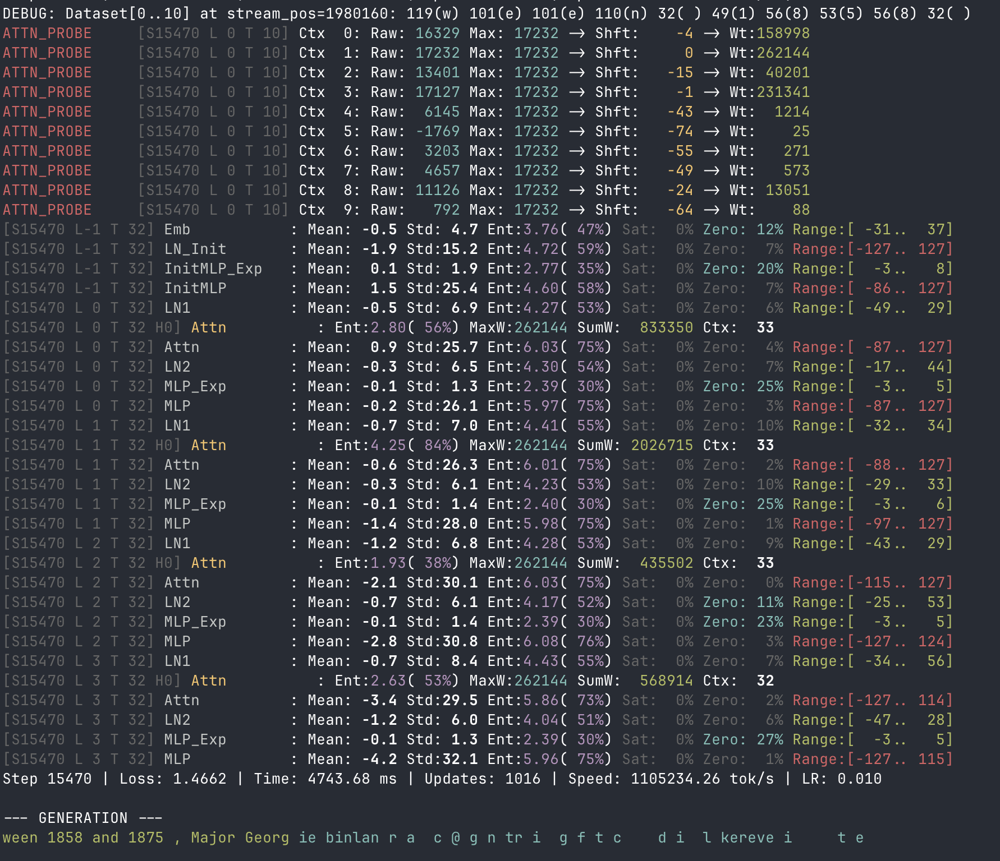

# EGGROLL in C

A minimalist, dependency-free implementation of the **EGGROLL** (Evolution Guided General Optimization via Low-rank Learning) algorithm family.

**Mission**: To get the most capable pairs of models / platforms cross-implementations of EGGROLL family of algorithms as possible and squeeze every possible bit of performance from the equipment, implementing everything required from the scratch in hardware-optimized fashion.

This project demonstrates **integer-only training** of a language model, completely bypassing the need for standard floating-point arithmetic or heavy ML frameworks like PyTorch or JAX.

<a id="key-features"></a>
## Key Features

*   **Pure C / Bare Metal**: Old-school fashioned and goal-oriented. Zero external dependencies on the CPU side, keeping it close to the metal.
*   **Apple Silicon Optimized**: Vectorized operations using ARM NEON intrinsics and parallelized via Grand Central Dispatch (GCD).
*   **NVIDIA CUDA Optimized**: Custom GPU kernels utilizing Warp-level primitives, Shared Memory, and CUB/Thrust for maximum throughput.
*   **Integer Only**: Operates primarily on `int8` weights/activations with `int32` (CPU) or `int64` (GPU) accumulation—sticking to integer math as long as it yields the best performance for the hardware.
*   **Gradient Free**: Uses Evolution Strategies (ES) with low-rank perturbations instead of backpropagation. It's both wisdom and freedom!

<a id="quick-start"></a>
## Quick Start

<a id="prepare-data"></a>
### 1. Prepare Data
Ensure you have a text dataset named `input.txt` in the current directory.

<a id="compile-and-run"></a>
### 2. Compile & Run

#### Apple Silicon / CPU
```bash
clang -O3 full_trained_egg.c -o egg
./egg
```

#### NVIDIA GPU (CUDA)
```bash
nvcc -O3 full_cuda_train_egg.cu -o egg_cuda
./egg_cuda
```


<a id="advanced-implementations"></a>
## Advanced Implementations

<a id="int8nativeformer"></a>
### Int8NativeFormer (`full_cuda_train_transformer_adam_mgpu.cu`)

An `int8` model.

*   **Native `int8` Architecture**: Operates on raw bytes with a compact `N`-layer, `H`-dim topology.
*   **Quantized Sigmoid Self-Attention**: An `int32/int64` accumulation scheme and quantized weighting.
*   **Auto-Norm & Entropy Monitoring**: Adaptive normalization layers.
*   **EGG DEBUG**: debug-printing "tool" to monitor entropy flow through the network and weights distribution and saturation.
*   **Information-Regulated Optimizer**: A hybrid **ES-AdamW** approach where the optimizer (`float32`) regulates the amount of updates applied to the integer weights, ensuring stable learning.
*   **Performance**: Achieves **~300k tokens/second** with a population of 40,000+ (8192×5) on a single 4090 GPU setup, reaching loss rates (~1.45 bits/byte).

<a id="multi-gpu-strategy"></a>

#### Multi-GPU Strategy
The system employs a **Synchronous Replicated Model** with **Sharded Evaluation**:
*   **Sharded Evaluation**: The population is split across GPUs, with each evaluating a subset of perturbations in parallel.
*   **Implicit Synchronization**: Instead of exchanging gradients (All-Reduce), GPUs receive only **fitness scores**. Since noise is deterministic, each GPU independently reconstructs the update, keeping replicas synchronized with negligible bandwidth.



#### Compile & Run (Multi-GPU)
```bash
nvcc -O3 -arch=native full_cuda_train_transformer_adam_mgpu.cu -o egg_transformer_mgpu
./egg_transformer_mgpu
```

<a id="debugging"></a>
### Debugging (`egg_debug_printer.h`)

A lightweight header-only tool for monitoring integer model stability and detecting saturation or mode collapse.

*   **Metrics**: Tracks Mean, StdDev, bit-level Entropy (0.00-8.00), and Saturation percentages per layer.
*   **Usage**: Define `EGG_DEBUG` during compilation to enable ANSI-colored logs for activations and attention scores.

<a id="configuration"></a>
## Configuration


## CPU vs GPU Builds

This repo currently has two main training entry points:

- `full_trained_egg.c`: the original single-binary CPU reference implementation.
- `full_trained_egg-cpumulti.c`: the multi-core, cross-arch CPU variant used by the `egg-macos-arm64`, `egg-linux-amd64`, and `egg-cpumulti` targets.

The GPU-oriented entry point is:

- `full_trained_egg-gpumulti.c`: for now this simply reuses the `full_trained_egg-cpumulti.c` training loop, but can be compiled with `EGG_BUILD_METAL` to call into a Metal backend on Apple Silicon.

### Metal Backend (Apple Silicon)

The Metal runtime is implemented in `full_trained_egg-gpu-metal.mm` and wired through a small C API in `egg_gpu_metal.h`. When you build:

```bash
make egg-gpu-macos-metal
```

**Note**: The target name was updated from `egg-gpumetal` to `egg-gpu-macos-metal` for consistency with other targets (`egg-cpu-macos-arm64`, `egg-cpu-linux-amd64`, etc.).

the build system:

- Compiles `full_trained_egg-gpumulti.c` with `-DEGG_BUILD_METAL`, which pulls in the CPU training loop and enables optional GPU paths (`EGG_USE_METAL`) for certain kernels.
- Compiles and links the Objective-C++ Metal runtime, which:
  - Creates a Metal device and command queue on the default GPU (e.g. Apple M2 Max).
  - Builds a small Metal library containing:
    - A rank-1 matmul kernel (`egg_matmul_perturbed_kernel`) used for the noisy matrix–vector multiplies in the GRU/MLP.
    - An update kernel (`egg_update_matrix_kernel`) that computes ES “votes” and flips weights accordingly.
  - Manages a set of persistent GPU buffers for inputs, weights, outputs, noise, and update parameters.

At runtime:

- `matmul_perturbed`:
  - Generates rank-1 noise on the CPU (to stay consistent with the reference).
  - Calls `egg_gpu_matmul_perturbed` when Metal is available:
    - Copies the input vector, weight matrix and noise slice into shared GPU buffers.
    - Dispatches `egg_matmul_perturbed_kernel` across all output rows.
    - Copies the resulting `out` vector back to host memory.
  - Falls back to the scalar/NEON/AVX2 C implementation if the GPU path is disabled or fails.

- `update_matrix`:
  - Precomputes the transposed noise buffers `A_T` and `B_T` exactly as in the CPU version.
  - Calls `egg_gpu_update_matrix`, which:
    - Copies `W`, `A_T`, and `B_T` into Metal buffers.
    - Launches `egg_update_matrix_kernel`, where each GPU thread computes the vote for a single `(row, col)` weight and applies the `UPDATE_THRESHOLD` rule.
    - Copies updated weights back to the host model.
  - Falls back to the CPU loop if the GPU path is unavailable.

This design keeps the math identical to the CPU path, but it is **not yet optimized for maximum performance**:

- We still transfer full weight matrices for every matmul and every update step.
- The GRU gating logic, layer norms, RNG, and sampling remain on the CPU.
- A single training “step” can involve tens of thousands of small GPU launches plus large CPU↔GPU copies, so the first step on a full 500MB+ dataset can take a long time to complete.

### Practical Notes for Metal Training

**⚠️ Performance Warning**: The Metal GPU backend (`egg-gpu-macos-metal`) is currently **significantly slower than the CPU version** (~5 minutes per step vs ~10 seconds on CPU). This is due to:

1. **Many small kernel launches**: Hundreds of small GPU kernels per forward pass, where kernel launch overhead dominates execution time.
2. **CPU SIMD efficiency**: The CPU version (`egg-cpu-macos-arm64`) uses NEON SIMD intrinsics that process everything efficiently in a single pass, which is well-suited for this workload pattern.
3. **GPU architecture mismatch**: GPUs excel at large parallel workloads, but this model has many sequential small operations that don't fully utilize GPU parallelism.

**Recommendation**: Use `egg-cpu-macos-arm64` for training on Apple Silicon. The Metal GPU path remains available for experimentation and future optimization work, but requires significant restructuring (kernel fusion, larger workgroups, operation batching) to be competitive.

To disable GPU and force CPU path even when Metal is available:
```bash
EGG_DISABLE_GPU=1 ./egg-gpu-macos-metal
```

- For **quick experiments** on Apple Silicon, it is strongly recommended to:
  - Use `egg-cpu-macos-arm64` for best performance.
  - If testing GPU path, reduce `SEQ_LEN` and `POPULATION_SIZE` in `egg_config.h`.
  - Optionally train on a truncated `input.txt` (e.g. a few MB) to see steps advancing more quickly.
- For **long runs**, keep in mind the current Metal backend is correctness-oriented; to make it truly faster than `egg-cpu-macos-arm64`, the next steps are:
  - Keep model weights live on the GPU instead of copying them for each matmul (✅ already implemented).
  - Batch more work into each kernel launch (e.g. multiple gates/layers/timesteps at once).
  - Fuse operations (e.g., layer norm + matmul) into single kernels to reduce launch overhead.
  - Gradually move GRU/LN glue and population evaluation onto the device.

<a id="community"></a>
## Community & Contributing

We are friendly and welcome all sorts of contributions!

*   **Testers**: Open issues with a description of your available compute, join existing issues if you can platforms described there.
*   **Moderators**: To keep all this under control.
*   **Creatives**: Even if you have nice creative IDEA on README design - you're welcome.

<a id="references"></a>
## References

* **Original JAX Implementation**: [ESHyperscale/nano-egg](https://github.com/ESHyperscale/nano-egg)
* **Original Paper & Project**: [EGGROLL Website](https://eshyperscale.github.io/)
