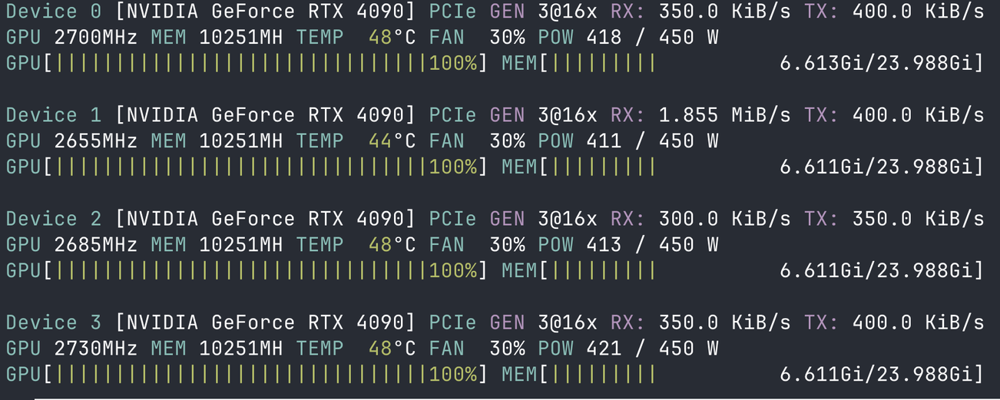
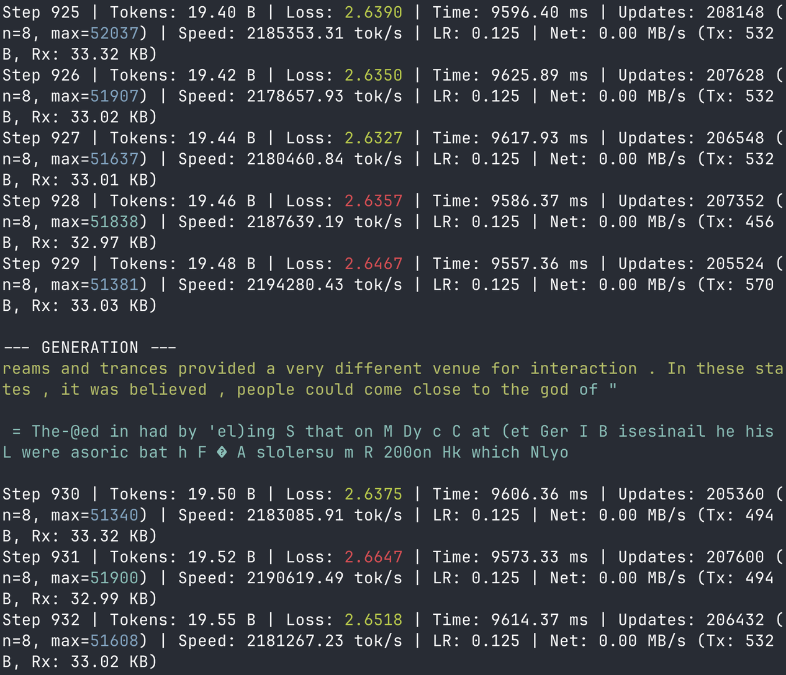

# Distributed EGGROLL (`d-eggs`)

A high-performance, distributed implementation of the EGGROLL algorithm designed for scaling across multiple GPUs and nodes.

## Architecture & Workflow

The system follows a **Coordinator-Worker** model designed for high throughput and fault tolerance.

1.  **Data Requirements**:
    *   Each compute node (worker) must have `input.bin` (training data) and `decoding.bin` (tokenizer vocabulary) in its working directory.
    *   The coordinator does not require these files.

2.  **Population Splitting**:
    *   The total `POPULATION_SIZE` (e.g., 327,680) is divided into smaller `CHUNK_SIZE` units (e.g., 40,960).
    *   Example: A population of ~320k is split into 8 chunks of ~40k each.

3.  **Job Queueing & Assignment**:
    *   The Coordinator maintains a queue of pending chunks for the current step.
    *   Chunks are assigned to the **first available worker** that requests a job.
    *   If a worker times out (straggler), the chunk is re-queued and assigned to another worker.

4.  **Result Aggregation**:
    *   Workers compute fitness scores for their assigned chunk.
    *   Scores are **ternary packed** (compressed to 1.58 bits/value) and sent back to the Coordinator.
    *   Once all chunks are completed, the Coordinator advances to the next step and broadcasts the updated state.

## Key Features (Enabled)

*   **Custom Binary Protocol**: Lightweight, versioned protocol with fixed-size headers and big-endian byte order for cross-platform compatibility.
*   **Fault Tolerance**: Robust against worker failures or network delays. The coordinator detects stragglers and re-assigns their work to other available workers.
*   **Efficiency**:
    *   **Ternary Packing**: Fitness scores are compressed into 2-bit values (packed 5 per byte), significantly reducing network bandwidth.
    *   **CUDA Graphs**: Optimizer steps are captured as CUDA Graphs to reduce kernel launch overhead.
*   **Uniform Random Distribution**: Model initialization and evolution noise use Uniform Random distribution by default (not Gaussian).
*   **Adaptive Training**:
    *   **Adaptive Noise Scaling**: Automatically adjusts noise scale per layer/parameter to maintain stability.
    *   **Chunk Mean Filter**: Favors perturbations that align with the local chunk trend.
    *   **Adaptive Thresholding**: Filters out weak signals based on mean absolute difference.
*   **Optimizers**:
    *   **AdamW**: Implements the AdamW optimizer (`d-eggs/include/optimizer/adam.cuh`) with quantized updates, maintaining float moments while updating integer weights.
    *   **SGD / Quantized Update**: Uses a threshold-based update mechanism (`d-eggs/include/optimizer/sgd.cuh`) to bridge floating-point gradients with integer-only weights.

## Generation & Sampling

The worker implements a custom CUDA kernel for sequence generation:

1.  **Presence Penalty**: Penalizes tokens that have already appeared in the sequence to reduce repetition.
2.  **Temperature Scaling**: Adjusts the randomness of predictions. Higher temperature flattens the distribution.
3.  **Min-P Sampling**: An efficient alternative to Top-P (Nucleus) sampling. It truncates the tail of the distribution by ignoring tokens with probability less than `min_p * max_prob`.
4.  **Selection**: Performs a weighted random selection from the filtered distribution.

Configuration via `include/config.h`:
*   `SAMPLING_TEMP` (Default: 0.6)
*   `SAMPLING_MIN_P` (Default: 0.08)
*   `SAMPLING_PRESENCE_PENALTY` (Default: 0.2)

## Experimental Features (Disabled by Default)

These features are implemented but disabled in `include/config.h`. Enable them by modifying the config or passing flags during compilation.

*   **Muon Optimizer** (`USE_MUON`): Momentum-based optimizer for potentially faster convergence.
*   **NTT Mode** (`NTT_MODE`): Number Theoretic Transform embeddings (Walsh-Hadamard, Fermat).
*   **Gaussian Noise** (`HOST_GAUSSIAN`, `DEVICE_GAUSSIAN`): Alternative noise generation strategies.

## Build & Run

### Prerequisites
*   NVIDIA GPU with CUDA support (Compute Capability 8.6+ recommended).
*   GCC/G++ and NVCC.

### Compilation
```bash
make
```
This produces three binaries:
*   `coordinator`: The central server.
*   `worker`: The GPU worker.
*   `print_arch`: Utility to print model architecture and parameter counts.

### Running

1.  **Prepare Data**:
    Ensure `input.bin` and `decoding.bin` are present on all worker nodes.

2.  **Start the Coordinator**:
    ```bash
    ./coordinator --save-dir ./checkpoints
    ```
    The coordinator listens on port `12345`.

3.  **Start Workers**:
    ```bash
    ./worker <coordinator_ip>
    ```
    Example (local):
    ```bash
    ./worker 127.0.0.1
    ```

    For a multi-GPU setup on a single machine, use the provided script:
    ```bash
    ./run-workers.sh
    ```

Typical PCIe traffic:



Typical `coordinator` output:



## Configuration

Configuration is handled via `include/config.h`. Key parameters include:
*   `HIDDEN_DIM`, `N_LAYERS`, `N_HEADS`: Model architecture.
*   `POPULATION_SIZE`, `CHUNK_SIZE`: Training scale.
*   `USE_MUON`, `ROPE_SCALE_BIT`: Advanced features.

Recompile after changing `config.h`.
